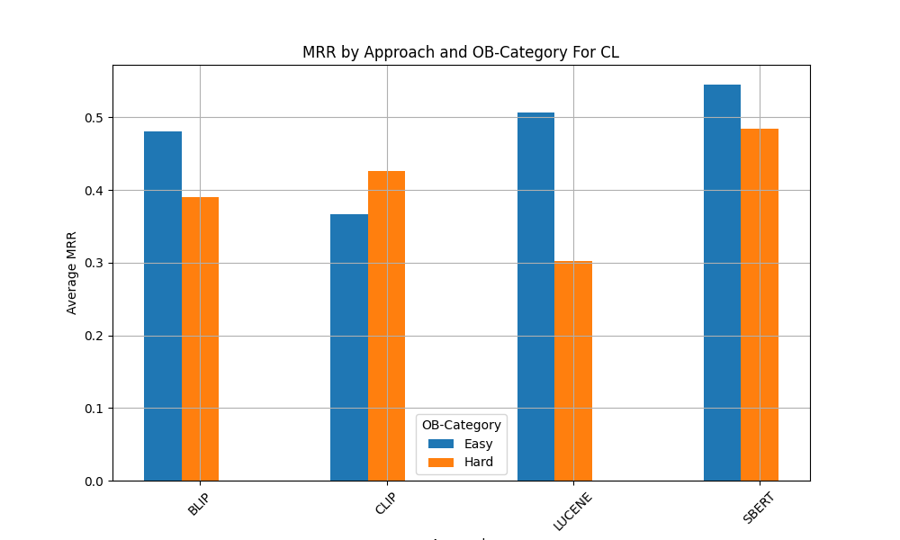
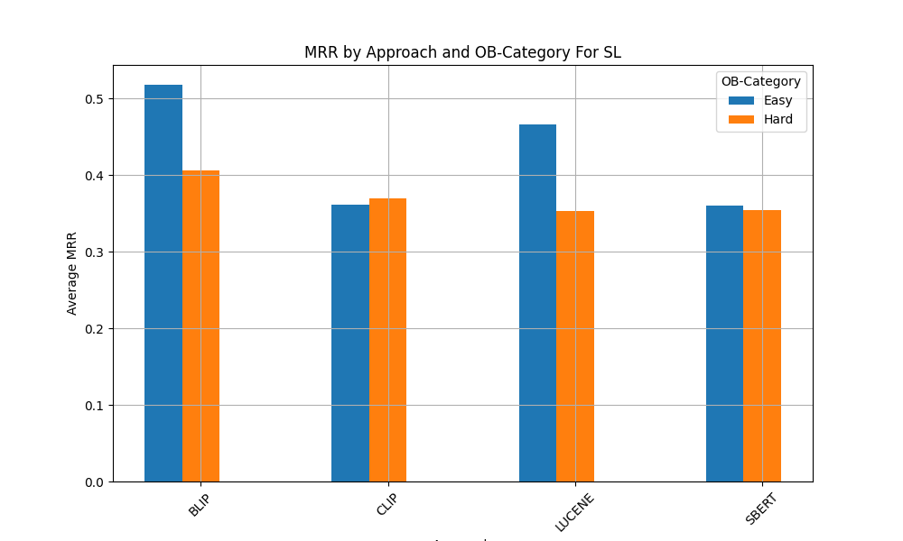
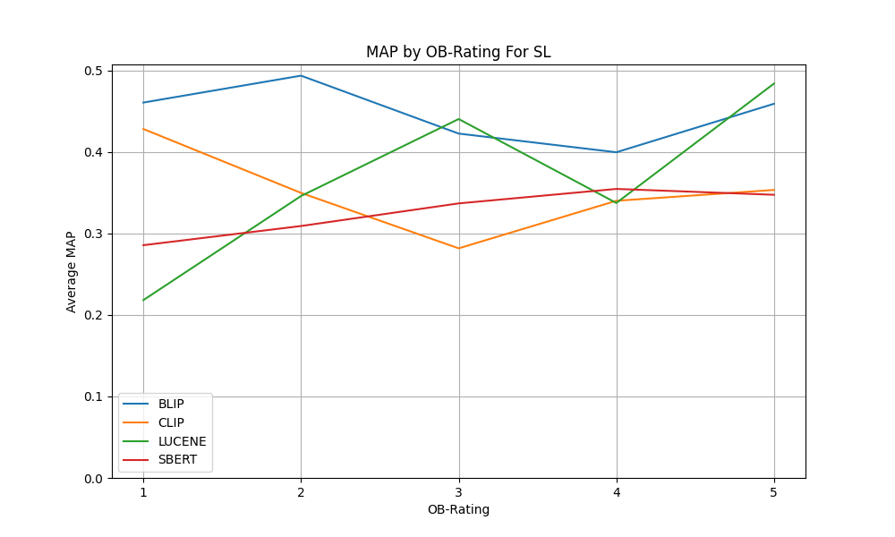

# Summary
This is the replication package for the ISSTA'24 paper titled "Toward the Automated Localization of Buggy Mobile App UIs from Bug Descriptions".
Authors: Antu Saha, Yang Song, Junayed Mahmud, Ying Zhou, Kevin Moran, and Oscar Chaparro.

In the paper, we conducted two studies:
1. Buggy UI Localization (study_1): We proposed localizing buggy UIs (screen and component) for a given bug descriptions (observed behaviors) of bug reports. We evaluated four models (i.e., LUCENE, SBERT, CLIP, and BLIP) to accomplish the buggy UI localization tasks (i.e., screen localization and component localization). 
2. Buggy Code Localization (study_2): We proposed automating an exising buggy code localization which uses GUI screen information by utilizing the localized buggy UIs from the buggy UI localization. We evaluated the buggy code localization performance on two models (i.e., LUCENE and BugLocator).

In this replication package, we refer to the Buggy UI Localization as ```study_1``` and the Buggy Code Localization as ```study_2```.

# Getting Started
This section contains the steps to set up the environment and reproduce the results of Buggy UI Localization tasks (study_1) and Buggy Code Localization experiments (study_2) of the paper. Note that study_1, i.e., Buggy UI Localization tasks (screen and component localization) are the main focus of the paper. All the experiments of study_1 can be replicated in 1 hour. However, replicating the results of study_2, i.e., Buggy Code Localization will take a while depending on the experiment. We already provided the results of all the experiments of both studies. Rerunning the experiments will overwrite the results.

## Video Demonstration For Running Study 1
[](https://www.youtube.com/watch?v=BUs4XUPkoyg)


## Setting up the Environment

Note: Use Linux or MacOS to run this project. If you are on Windows, we recommend you to use WSL


  * Run ```environment.sh``` for setting up your environment necessary to run the project with this command: ```sh environment.sh```
    * Installs Java 11 JDK
    * Installs Python 3.10
    * Installs Apache Maven (3.6.3)
    * Adds JDK and Maven to your file path
    * Installs pip
    * Installs Python modules required for this artifact

Note: If you already have a previous Python version installed, run ```python3 --version``` to see if you have the correct version of ```Python 3.10.12```. If not, change your Python version to 3.10.12

## Reproducing the Results of Buggy UI Localization (study_1)

Note: study_1_fix_issues.sh only works for Linux or MacOS users
1. Run ```study_1_fix_issues.sh``` to fix all the issues for the project with this command: ```sh environment.sh```
* ```study_1_fix_issues.sh``` resolves:
  * Adds missing dependencies to pom.xml (commons-io, commons-cli, org.slf4j, Stanford CoreNLP)
  * Downloads all required dependencies
  * Fixes wrong file paths mentioned in the repository
  * Fixes CUDA function with GPU used for CLIP testing

2. Run ```run_cmnd.sh``` for reproducing the results with this command: ```sh run_cmnd.sh```. If you use windows, please create a similar script. This script will run all the experiments of Study 1. The experiments can be run within one hour using this script. For running each experiment separately, please comment out the commands of other experiments.
3. The results will be stored in the ```results``` directory where ```SL``` folder will contain screen localization results and ```CL``` will contain component localization results. The results are already provided (as CSV files). Rerunning the experiments will overwrite the results.
4. The results summary will be saved in ```study_1/results/results_summary.xlsx``` file. The file is already provided. Rerunning the script will overwrite the results summary.
5. Performance comparing different models using different metrics (h@k, MAP, MRR) are stored in ```study_1/results/graphs```.
## Reproducing the Results of Buggy Code Localization (study_2)

1. Go to `study_2/concat_and_first_ob_experiments/Lucene/code_search_ir_preprocess_data/pom.xml` and add the additional dependencies shown below

```
<dependency>
    <groupId>commons-io</groupId>
    <artifactId>commons-io</artifactId>
    <version>2.11.0</version>
</dependency>
<dependency>
    <groupId>commons-cli</groupId>
    <artifactId>commons-cli</artifactId>
    <version>1.4</version>
</dependency>
<dependency>
    <groupId>org.apache.lucene</groupId>
    <artifactId>lucene-core</artifactId>
    <version>5.3.0</version>
</dependency>
<dependency>
    <groupId>edu.stanford.nlp</groupId>
    <artifactId>stanford-corenlp</artifactId>
    <version>3.8.0</version> <!-- Or the version you're using -->
</dependency>
<dependency>
    <groupId>edu.stanford.nlp</groupId>
    <artifactId>stanford-corenlp</artifactId>
    <version>3.8.0</version>
    <classifier>models</classifier>
</dependency>
<dependency>
    <groupId>org.slf4j</groupId>
    <artifactId>slf4j-simple</artifactId>
    <version>1.7.32</version>
</dependency>
```


2. Please follow the instructions provided in the ```study_2/concat_and_first_ob_experiments/README.md``` to reproduce the results of CONCAT_OB and FIRST_OB experiments of study_2.
3. Please follow the instructions provided in the ```study_2/individual_ob_experiments/README.md``` to reproduce the results of INDIVIDUAL_OB experiments of study_2.
4. The results of all the experiments will be stored in the ```study_2/FinalResults``` directory and the results summary will be stored in ```study_2/ResultsSummary``` directory. The results are already provided (as CSV and xlsx files). Rerunning the experiments will overwrite the results.

# Detailed Description
This section contains the detailed description of the directories and files in this repository. It also contains the information of the experiments of the two studies and instructions to run the experiments.
## study_1: Buggy UI Localization
This directory contains all the necessary codes, data, and results to reproduce the Buggy UI Localization (SL: Screen Localization and CL: Component Localization), i.e., study_1. 
### Directory Structure
```study_1``` directory contains the following subdirectories:
1. ```lucene:``` contains the codes to run the buggy UI localization (SL and CL) with LUCENE.
    * ```src/main/java/ScreenLocalization.java:``` this java file will perform the Screen Localization (SL) with LUCENE.
    * ```src/main/java/ComponentLocalization.java:``` this java file will perform the Component Localization (CL) with LUCENE.
    * ```lib:``` this folder contains the required libraries.
    * ```required_projects:``` this folder contains required projects for performing SL and CL.
2. ```sentence_bert:``` contains the codes to run the buggy UI localization (SL and CL) with SBERT.
    * ```screen_and_component_localization.py:``` this python script will perform the Screen Localization (SL) and Component Localization (CL) with SBERT.
    * ```utils.py:``` this script contains necessary user-defined functions for performing SL and CL.
    * ```evaluation_metrics.py:``` this script contains the necessary functions for measuring the performance of the models for SL and CL.
3. ```clip:``` contains the codes to run the buggy UI localization (SL and CL) with CLIP.
    * ```screen_localization.py:``` this python script will perform the Screen Localization (SL) with CLIP.
    * ```component_localization.py:``` this python script will perform the Component Localization (CL) with CLIP.
    * ```utils.py:``` this script contains necessary user-defined functions for performing SL and CL.
    * ```evaluation_metrics.py:``` this script contains the necessary functions for measuring the performance of the models for SL and CL.
4. ```blip:``` contains the codes to run the buggy UI localization (SL and CL) with BLIP.
5. ```dataset:``` contains the real data, data statistics, and codes to prepare queries for conducting SL and CL.
    * ```real_data:``` contains the constructed real data for conducting SL and CL.
      * ```component_images:``` contains the component images for each bug report and each screen. This is used to conduct the CL experiments with CLIP and BLIP.
      * ```dataset_info:``` contains the information about the dataset (screen, component, and query info). 
      * ```ob:``` contains the queries (OB description) from all the bug reports. ```obs.json``` was used to conduct the SL and CL experiments.
      * ```screen_components:``` contains the textual information of the screens for each bug report. This is used to conduct the SL experiments with LUCENE and SBERT.
      * ```screen_images:``` contains the screen images for each bug report. This is used to conduct the SL experiments with CLIP and BLIP.
6. ```results:``` contains the results of the buggy UI localization (two separate folders for SL and CL experiment results) with LUCENE, SBERT, CLIP, and BLIP. The results are already provided (as CSV files). Rerunning the experiments will overwrite the results. Additionally, we provided three python script to create fine-grained results and results summary.
### Running the Experiments
1. There are 8 experiments in total in study_1 (i.e., Buggy UI Localization).
    * Screen Localization (SL)
      * LUCENE
      * SBERT
      * CLIP
      * BLIP
    * Component Localization (CL)
      * LUCENE
      * SBERT
      * CLIP
      * BLIP
2. All the experiments can be run using the ```run_cmnd.sh``` script in the root directory. For running each experiment separately, please comment out the commands of other experiments.
3. The results will be stored in the ```study_1/results``` directory where ```SL``` folder will contain screen localization results and ```CL``` will contain component localization results. The results are already provided (as CSV files). Rerunning the experiments will overwrite the results.
4. The results summary will be saved in ```study_1/results/results_summary.xlsx``` file. The file is already provided. Rerunning the script will overwrite the results summary.
## study_2: Buggy Code Localization Utilizing Buggy UI Localization
This directory contains all the necessary codes, data, and results to reproduce the Buggy Code Localization (study_2) experiments utilizing Buggy UI Localization. 
### Directory Structure
```study_2``` directory contains the following subdirectories:
1. ```concat_and_first_ob_experiments:``` contains the codes to reproduce the results of the experiments with Concat OB and First OB. It also contains the results. Please see the README.md file inside this directory for more details with steps to run the experiments.
2. ```individual_ob_experiments:``` contains the codes to reproduce the results of the experiments with Individual OB. Please see the README.md file inside this directory for more details with steps to run the experiments.
3. ```data:``` contains the data required to run the experiments. ```PreprocessedData``` folder will contain the preprocessed data after running the experiments.
4. ```FinalResults:``` contains the results of the experiments. The results are already provided (as CSV files). Rerunning the experiments will overwrite the results.
5. ```ResultsSummary:``` contains the script to generate the results summary. The results summary is already provided (as xlsx files). Rerunning the script will overwrite the results summary.
### Running the Experiments
1. There are 10 experiments in total in study_2 (i.e., Buggy Code Localization).
    * CONCAT_OB
      * LUCENE with 3 screens
      * BugLocator with 3 screens
      * LUCENE with 4 screens
      * BugLocator with 4 screens
    * FIRST_OB
      * LUCENE with 3 screens
      * BugLocator with 3 screens
      * LUCENE with 4 screens
      * BugLocator with 4 screens
    * INDIVIDUAL_OB
      * LUCENE with 3 screens
      * LUCENE with 4 screens
2. To run the CONCAT_OB and FIRST_OB experiments, please follow the instructions provided in the ```study_2/concat_and_first_ob_experiments/README.md```.
3. To run the INDIVIDUAL_OB experiments, please follow the instructions provided in the ```study_2/individual_ob_experiments/README.md```.
4. The results of all the experiments will be stored in the ```study_2/FinalResults``` directory and the results summary will be stored in ```study_2/ResultsSummary``` directory. The results are already provided (as CSV and xlsx files). Rerunning the experiments will overwrite the results.
## Other Files
Besides the above directories, this repository contains the following files:
1. ```Paper.pdf``` is the accepted version of the paper titled "Toward the Automated Localization of Buggy Mobile App UIs from Bug Descriptions". Note that this is not the final version of the paper. We will submit the final version in the camera-ready deadline.
2. ```requirements.txt``` contains the required packages to run the experiments.
3. ```run_cmnd.sh``` is an automated script to run all the experiments of study_1. The experiments can be run in one hour using this script.
4. ```readme.md``` is the current file that contains the detailed description of the directories and files in this repository. This file also contains the instructions to set up the environment and reproduce the results of the Buggy UI Localization tasks (Study 1).

# Results
This section contains pictures for the produced results of this study
## Results for Study 1




